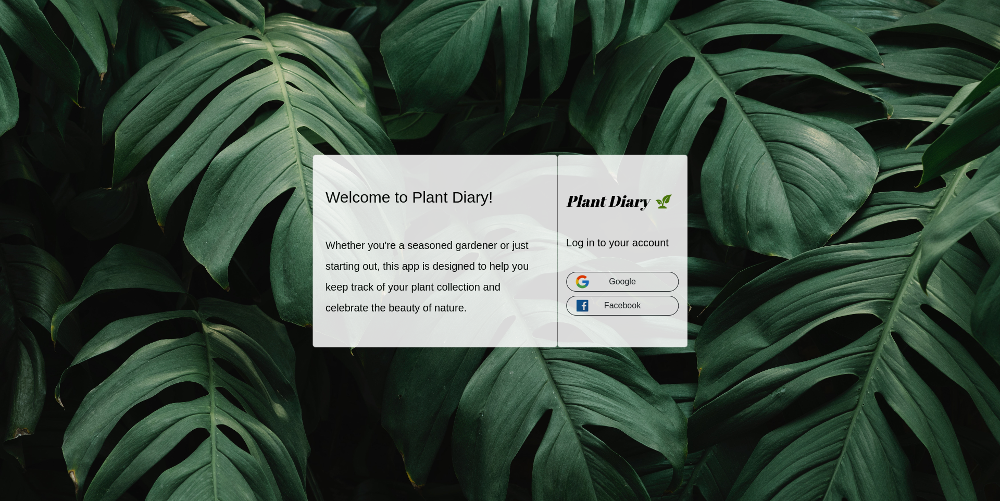
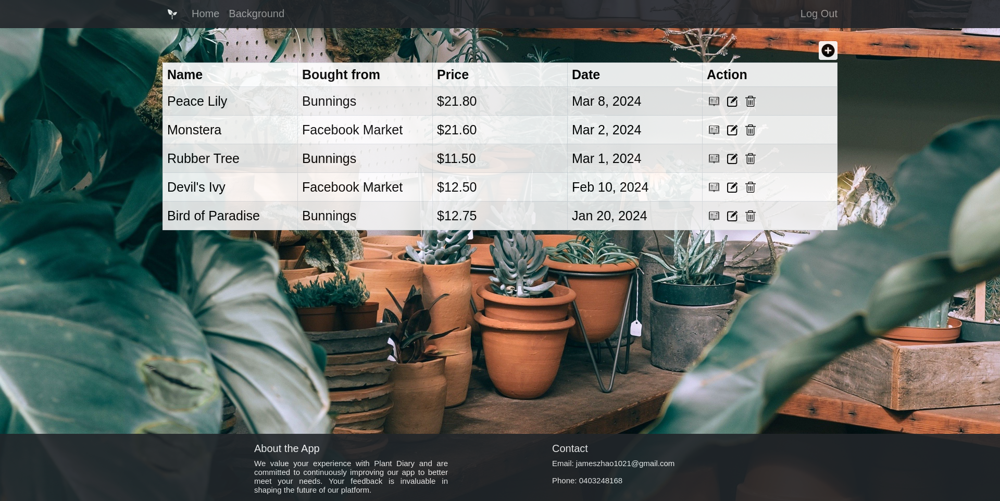
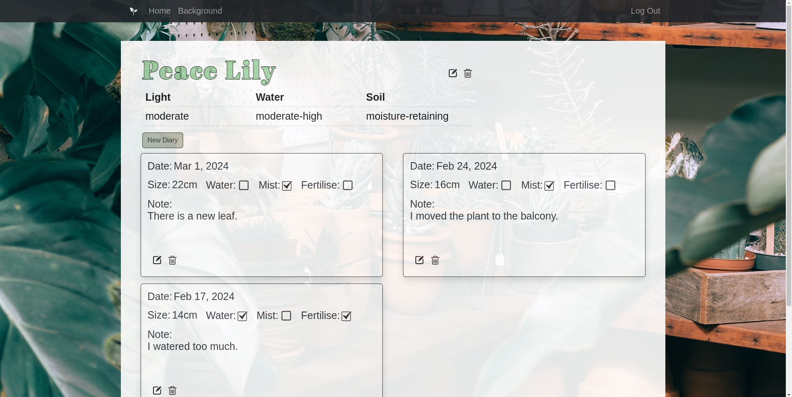
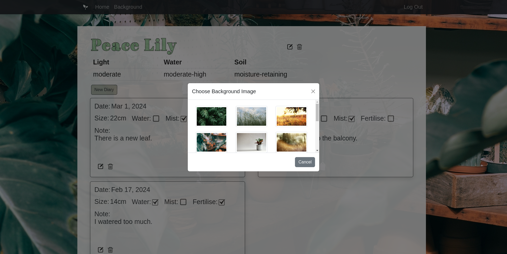

# Plant Diary

Welcome to Plant Diary!

Whether you're a seasoned gardener or just starting out, this app is designed to help you keep track of your plant collection and enjoy the beauty of nature.

With Plant Diary, you can effortlessly log the growth and care of each plant in your collection, add watering, misting and fertilising records, and monitor their progress over time.

## Screenshot

Login page

List of plant

Diary page

Customised background image

## Technologies Used

JQuery, Ajax, Bootstrap, Express and MongoDB were used in this game.

## Getting Started

Clone the app from https://github.com/jameszhao1021/Plant-Diary.git.
1. Log in to the app with your Google or Facebook account. Different accounts are separated from each other.
2. Click the add button on the top right corner to add a plant to the list.
3. You can edit or delete any existing plant from the list.
4. Click the detail button will redirect you to the diary page.
5. You can add details for the plant, and the details can be edited or deleted.
6. Click the new diary button to create a diary. The inline editing feature allows you to edit the information easily.
7. You can change the background image by clicking the background button on the nav bar.
  
## Next Steps

In addition to changing the background, I will create more customized features such as adjusting font family, font size, etc. Furthermore, I will spend more time improving the user interface, and create more animations and hover effects. Allowing users to update pictures in their diaries is the next goal.
